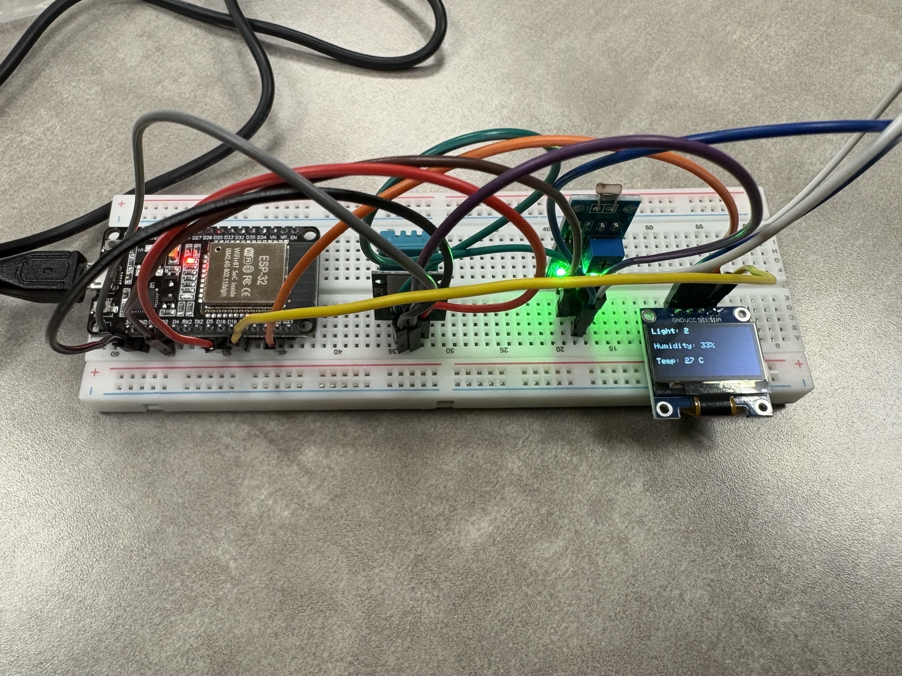
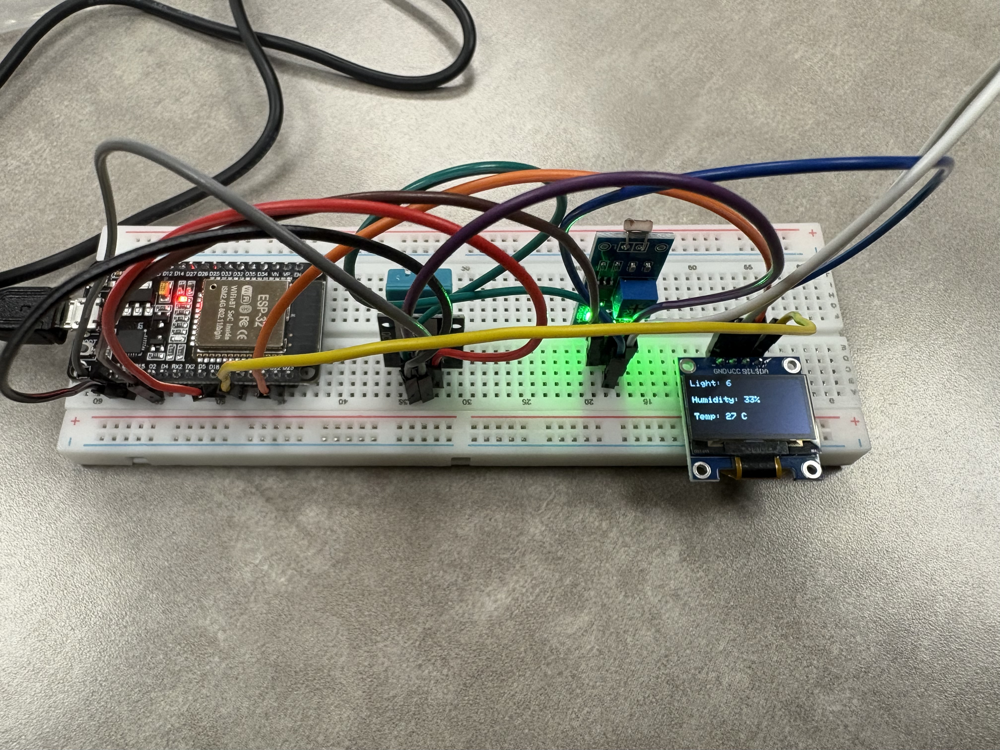

# Smart Environmental Monitoring System

**ESP32 • C++ • I2C • DHT11 • ADC • SSD1306 OLED**

An ESP32-based environmental monitoring system that concurrently samples temperature, humidity, and light intensity and displays live readings on a 128×64 OLED screen — all without blocking the CPU.

---

## Hardware Demo

> Live system running — OLED displaying real-time temperature, humidity, and light readings




---

## Features

- **Non-blocking firmware architecture** — concurrent sensor sampling via task scheduling without CPU blocking
- **DHT11 sensor integration** — real-time temperature and humidity acquisition with checksum/timeout fault handling
- **12-bit ADC photoresistor** — ambient light level sampling via analog-to-digital conversion
- **I2C OLED display** — 128×64 SSD1306 driven at address `0x3C` via Adafruit GFX library
- **Modular subroutine architecture** — hardware-abstracted macros for clean, maintainable firmware
- **Serial monitoring** — real-time debug output via 115200 baud serial connection

---

## Hardware Components

| Component | Purpose |
|---|---|
| ESP32 Dev Board | Main microcontroller |
| DHT11 Sensor | Temperature & humidity acquisition |
| Photoresistor + LDR module | Ambient light sensing via ADC |
| SSD1306 128×64 OLED | Real-time data display |
| Breadboard + jumper wires | Prototyping |

---

## Wiring

| Component | Pin | ESP32 GPIO |
|---|---|---|
| DHT11 DATA | → | 18 |
| OLED SDA | → | 21 |
| OLED SCL | → | 22 |
| LDR AO | → | 2 |
| DHT11 VCC / OLED VCC / LDR VCC | → | 3V3 |
| DHT11 GND / OLED GND / LDR GND | → | GND |

---

## Getting Started

### Prerequisites
Install these libraries via Arduino Library Manager:
- `DHTesp`
- `Adafruit GFX Library`
- `Adafruit SSD1306`

### Run It

```bash
git clone https://github.com/lia-angela06/environmental-monitoring-system.git
```

1. Open `sketch.ino` in Arduino IDE
2. Select your ESP32 board under **Tools > Board**
3. Select the correct COM port under **Tools > Port**
4. Click **Upload**

---

## System Architecture

```
┌─────────────┐     I2C (0x3C)    ┌─────────────┐
│  SSD1306    │◄──────────────────│             │
│  OLED       │                   │    ESP32    │
└─────────────┘                   │             │
                                  │  GPIO 18 ◄──┼── DHT11 (Temp/Humidity)
                                  │  GPIO 2  ◄──┼── LDR Module (Light)
                                  └─────────────┘
```

---

## Performance

- Display refresh rate: **30 FPS**
- Sensor sampling: non-blocking, concurrent
- Runtime faults: **0**
- Humidity readings: stable within **50–80% RH** range

---

## Skills Demonstrated

`Embedded Systems` `Firmware Development` `C++` `I2C Protocol` `ADC` `Real-Time Systems` `Hardware Debugging` `Modular Architecture` `Non-Blocking Programming`

---

*Built during an IEEE workshop @ Virginia State University — Spring 2025*
